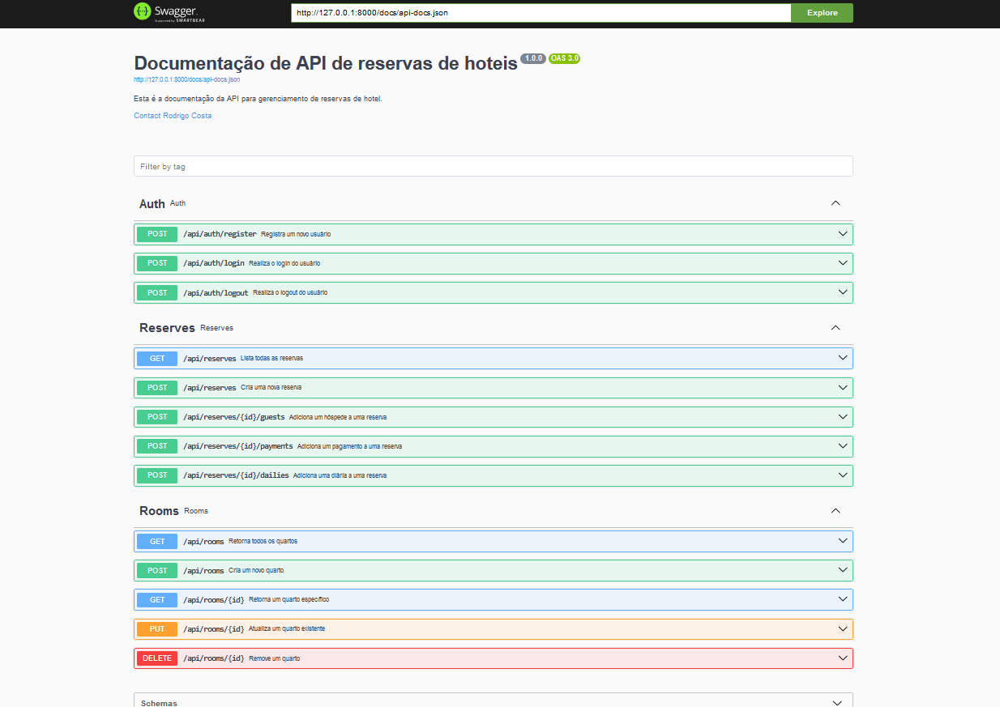
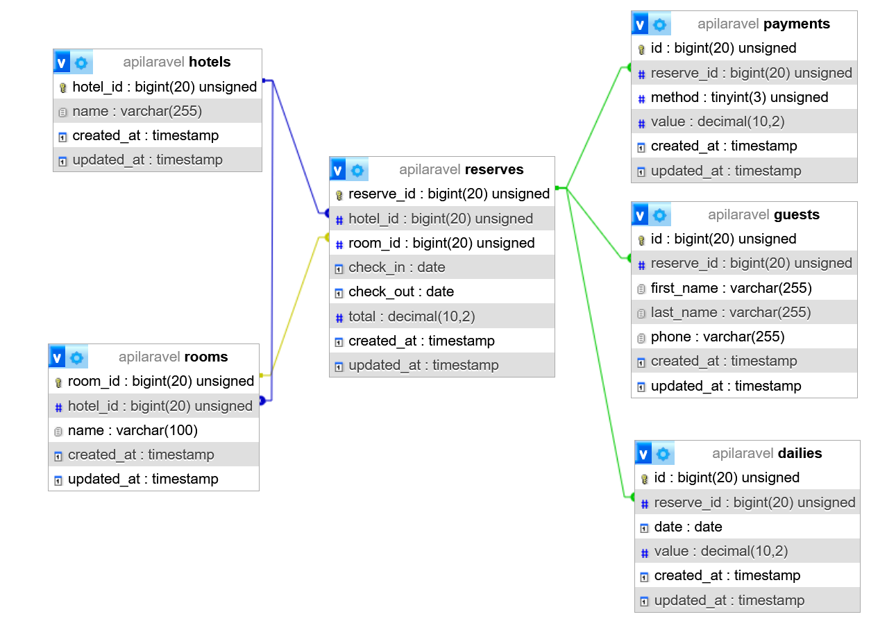

# Documentação de Arquitetura de Software

## Projeto: Teste de Estágio da Foco Multimídia utilizando API Rest
- **Autor:** Rodrigo Costa Neves
- **Data:** 29/10/2024 - 05/11/2024
- **Versão:** 1.0

### Ferramentas Utilizadas
- PHP 8.2.12
- Laravel 11.30.0
- Laravel Sanctum
- MySQL
- Swagger
- Docker
- Git(versionamento)

---

### Como Rodar o Sistema

1. **Clone o repositório:**

   ```bash
   git clone "https://github.com/Rodrigo-Cn/ApiRestLaravel.git"
   ```

O sistema pode ser executado de duas formas:

2. **Execução Local:**
   - Configure o banco de dados no `.env` com base na estrutura do `.env.example`.
   - Crie a base de dados `apilaravel`
   - Suba seu banco de dados localmente
   - Use `php artisan serve` para iniciar a aplicação.

3. **Execução com Docker:**
   - Tenha **Docker** instalado em sua máquina.

   - Crie o arquivo `.env` com os dados registrados no `.env.example`, atualizando as configurações do banco:

     ```dotenv
     DB_CONNECTION=mysql
     DB_HOST=mysql
     DB_PORT=3308
     DB_DATABASE=apilaravel
     DB_USERNAME=root // Seu username
     DB_PASSWORD=password // Sua senha
     ```

   - Configure o arquivo `docker-compose.yml` para que os parâmetros do MySQL coincidam com os do `.env`.
  
      ```dotenv
      environment:
         DB_CONNECTION: mysql
         DB_HOST: mysql

      DB_PORT: 3308
      DB_DATABASE: apilaravel
      DB_USERNAME: //seu username
      DB_PASSWORD: //suasenha

      mysql:
       image: mysql:5.7
       container_name: mysql
       restart: always
       environment:
         MYSQL_ROOT_PASSWORD: //suasenha
         MYSQL_DATABASE: apilaravel
       ports:
         - "3308:3306" //host:portacontainer
       networks:
         - laravel_app
     ```

### Executando a Aplicação com Docker

1. Construa e inicie os containers:

   ```bash
   docker compose build application
   docker compose up -d
   ```

2. Execute os comandos a seguir para configurar a aplicação:

   ```bash
   docker compose exec application composer install
   docker compose exec application npm install
   docker compose exec application php artisan key:generate
   docker compose exec application php artisan migrate
   ```

3. Para popular o banco de dados com dados XML:

   ```bash
   docker compose exec application php artisan app:import-database-xml-all
   docker compose exec application php artisan db:seed --class=UserSeeder
   ```

---

### Rotas da API

- Autenticação com Laravel Sanctum:
  - **Login:** `/api/login` - `AuthController@login`
  - (Se quiser retirar a validação por token das rotas só comentar o “$this->middleware('auth:sanctum');” no construtor de Room e Reserve.)

   Para acessar as rotas de `POST`, `PUT` e `DELETE`, você precisará de um token de autenticação. Use o seguinte JSON para autenticação:
   ```json
   {
       "email": "admin@gmail.com",
       "password": "password"
   }

- Após login, use o token obtido para autenticar as requisições protegidas.
- Para acessar as rotas assinaladas acima indique no Header

   | Key            | Value                  |
   |----------------|------------------------|
   | Content-Type   | application/json       |
   | application/json| application/json      |
   | Authorization  | {seutoken}             |

#### Endpoints Principais

- Para acessar as rotas no Docker utilize: `http://localhost/api/suarota`
- Localmente utiliza-se a rota padrão

| Método | Rota                          | Controller               |
|--------|-------------------------------|--------------------------|
| GET    | /api/rooms                    | RoomController@index     |
| POST   | /api/rooms                    | RoomController@store     |
| PUT    | /api/rooms/{id}               | RoomController@update    |
| DELETE | /api/rooms/{id}               | RoomController@destroy   |
| POST   | /api/reserves                 | ReserveController@store  |
| POST   | /api/reserves/{id}/guest      | ReserveController@storeGuest |
| POST   | /api/reserves/{id}/payment    | ReserveController@storePayment |
| POST   | /api/reserves/{id}/daily      | ReserveController@storeDaily |
| GET    | /api/reserves                 | ReserveController@index  |
| POST   | /api/login                    | AuthController@login     |
| POST   | /api/register                 | AuthController@register  |
| POST   | /api/logout                   | AuthController@logout    |
| GET    | /api/documentation            | Swagger Documentation    |

---

### Documentação gerada com Swagger



---

### Estrutura do Banco de Dados

- Arquivos **migrations**, **models**, **factories** e **controllers** foram criados com o comando:

  ```bash
  php artisan make:model NomeModel -cfm
  ```

- **Docker:** Banco de dados MySQL e PHPMyAdmin facilitam a visualização e manipulação dos dados.

#### Diagrama Entidade-Relacionamento


- (As Migrations estão no final desse documento)

---

### Modelagem e Organização do Código

- **MVC com Eloquent ORM:** Padrão seguido para estrutura e modelagem das entidades.
- **APIs:** Controllers separados na pasta `api/v1` para manipulação dos dados do CRUD de quartos e reservas.
- **Comando Cron:** Criado para persistir dados dos arquivos XML no banco de dados.

#### Executar CRON para Importação dos Arquivos XML

Todos os arquivos:

```bash
php artisan app:import-database-xml-all 
```

Um por vez:

```bash
php artisan app:import-database-xml storage/hotels.xml
php artisan app:import-database-xml storage/rooms.xml
php artisan app:import-database-xml storage/reserves.xml
```

É possível importa arquivos em outros diretórios através desse comando:

```bash
php artisan app:import-database-xml sua/rota/xml
```

---

### Segurança e Validação

- **Validações:** Implementadas no Request para evitar injeções SQL.
- **Autenticação:** Laravel Sanctum foi configurado para segurança das rotas.
- **Filtros e Logs:** Adicionados para monitorar as operações e limitar os atributos retornados.

---

### Testes

1. **Testes Unitários de Banco de Dados e Rotas:**
   - **DatabaseTest:** `tests/Unit/DatabaseTest.php`
   - **RoomsGetTest:** `tests/Unit/RoomsGetTest.php`
   - **ReservesGetTest:** `tests/Unit/ReservesGetTest.php`

2. **Executar Testes:**

   ```bash
   vendor/bin/phpunit tests/Unit/DatabaseTest.php
   vendor/bin/phpunit tests/Unit/RoomsGetTest.php
   vendor/bin/phpunit tests/Unit/ReservesGetTest.php
   ```

---

### Documentação Swagger

1. **Instalação e Configuração:**

   ```bash
   composer require darkaonline/l5-swagger
   php artisan vendor:publish --provider="L5Swagger\L5SwaggerServiceProvider"
   php artisan l5-swagger:generate   //Comando que utilizei para gerar documentação
   ```

2. **Acesso:** A documentação pode ser visualizada na rota `/api/documentation`.

> **Referências para desenvolvimento com swagger:**
> - Swagger: [https://swagger.io/](https://swagger.io/)

---

### Estrutura de Projeto e Design Patterns

- Seguido o padrão **MVC** do Laravel.
- **Factories** e **Seeders** foram implementados para popular o banco de dados com dados de teste.
- **RepositoryInterface:** Padrão de repositório para consistência no CRUD e reutilização de código.
- **Request:** Padrão de repositório para validação das requesições.  
--- 

Execução individual de cada Seeder
(Os seeders tem por padrão o id 7 em seus relacionamentos)

```bash
php artisan db:seed --class=RoomSeeder
php artisan db:seed --class=ReserveSeeder
php artisan db:seed --class=UserSeeder 
php artisan db:seed --class=GuestSeeder 
php artisan db:seed --class=DailySeeder 
php artisan db:seed --class=PaymentSeeder 
```
Execução de todos de uma vez

```bash
php artisan db:seed
```

---

**Logs:** Adicionados nos controllers para rastreamento e monitoramento de operações.
- É possível acessar os logs em `storage/logs/laravel.log`

---

**Reserve** Adicionei a possibilidade de adicionar diárias, pagamentos, hóspedes, disconto e juros.

- Aqui está um exemplo do json para cadastrar uma reserva(diárias, pagamentos, discontos e juros não são obrigatórios)
```json
{
    "hotel_id": 1,
    "room_id": 1,
    "guest": [
        {
            "first_name": "João",
            "last_name": "Silva",
            "phone": "77999999999"
        }
    ],
    "check_in": "2024-11-10",
    "check_out": "2024-11-15",
    "daily": [
        {
            "date": "2024-11-10",
            "value": 100.0
        },
        {
            "date": "2024-11-11",
            "value": 100.0
        },
        {
            "date": "2024-11-12",
            "value": 100.0
        },
        {
            "date": "2024-11-13",
            "value": 100.0
        },
        {
            "date": "2024-11-14",
            "value": 100.0
        }
    ],
    "payments": [
        {
            "method": 1,
            "value": 200.0
        }
    ],
    "discount": 50.0,
    "interest": 20.0
}
```

---

**Migrations:** Tabelas adicionadas no sistema.

- Hotel:
```bash
<?php

use Illuminate\Database\Migrations\Migration;
use Illuminate\Database\Schema\Blueprint;
use Illuminate\Support\Facades\Schema;

return new class extends Migration
{
    /**
     * Run the migrations.
     */
    public function up(): void
    {
        Schema::create('hotels', function (Blueprint $table) {
            $table->id('hotel_id');
            $table->string('name');
            $table->timestamps();
        });
    }

    /**
     * Reverse the migrations.
     */
    public function down(): void
    {
        Schema::dropIfExists('hotels');
    }
};
```

- Room:
```bash
<?php

use Illuminate\Database\Migrations\Migration;
use Illuminate\Database\Schema\Blueprint;
use Illuminate\Support\Facades\Schema;

return new class extends Migration
{
    /**
     * Run the migrations.
     */
    public function up(): void
    {
        Schema::create('rooms', function (Blueprint $table) {
            $table->id('room_id');
            $table->unsignedBigInteger('hotel_id');
            $table->string('name', 100)->notNullable();
            $table->foreign('hotel_id')->references('hotel_id')->on('hotels')->onDelete('cascade');
            $table->timestamps();
        });
    }

    /**
     * Reverse the migrations.
     */
    public function down(): void
    {
        Schema::dropIfExists('rooms');
    }
};
```

- Reserves:
```bash
<?php

use Illuminate\Database\Migrations\Migration;
use Illuminate\Database\Schema\Blueprint;
use Illuminate\Support\Facades\Schema;

return new class extends Migration
{
    /**
     * Run the migrations.
     */
    public function up(): void
    {
        Schema::create('reserves', function (Blueprint $table) {
            $table->id('reserve_id');
            $table->unsignedBigInteger('hotel_id');
            $table->unsignedBigInteger('room_id');
            $table->date('check_in');
            $table->date('check_out');
            $table->decimal('total', 10, 2);
    
            $table->foreign('hotel_id')->references('hotel_id')->on('hotels')->onDelete('cascade');
            $table->foreign('room_id')->references('room_id')->on('rooms')->onDelete('cascade');
    
            $table->timestamps();
        });
    }

    /**
     * Reverse the migrations.
     */
    public function down(): void
    {
        Schema::dropIfExists('reserves');
    }
};
```

- Daily:
```bash
<?php

use Illuminate\Database\Migrations\Migration;
use Illuminate\Database\Schema\Blueprint;
use Illuminate\Support\Facades\Schema;

return new class extends Migration
{
    /**
     * Run the migrations.
     */
    public function up(): void
    {
        Schema::create('dailies', function (Blueprint $table) {
            $table->id();
            $table->unsignedBigInteger('reserve_id');
            $table->date('date');
            $table->decimal('value', 10, 2);

            $table->foreign('reserve_id')->references('reserve_id')->on('reserves')->onDelete('cascade');

            $table->timestamps();
        });
    }

    /**
     * Reverse the migrations.
     */
    public function down(): void
    {
        Schema::dropIfExists('dailies');
    }
};
```

- Payment:
```bash
<?php

use Illuminate\Database\Migrations\Migration;
use Illuminate\Database\Schema\Blueprint;
use Illuminate\Support\Facades\Schema;

return new class extends Migration
{
    /**
     * Run the migrations.
     */
    public function up(): void
    {
        Schema::create('payments', function (Blueprint $table) {
            $table->id();
            $table->unsignedBigInteger('reserve_id');
            $table->unsignedTinyInteger('method');
            $table->decimal('value', 10, 2);
            $table->timestamps();

            $table->foreign('reserve_id')->references('reserve_id')->on('reserves')->onDelete('cascade');
        });
    }

    /**
     * Reverse the migrations.
     */
    public function down(): void
    {
        Schema::dropIfExists('payments');
    }
};
```

- Guest:
```bash
<?php

use Illuminate\Database\Migrations\Migration;
use Illuminate\Database\Schema\Blueprint;
use Illuminate\Support\Facades\Schema;

return new class extends Migration
{
    /**
     * Run the migrations.
     */
    public function up(): void
    {
        Schema::create('guests', function (Blueprint $table) {
            $table->id();
            $table->unsignedBigInteger('reserve_id');
            $table->string('first_name');
            $table->string('last_name');
            $table->string('phone')->nullable();
            $table->foreign('reserve_id')->references('reserve_id')->on('reserves')->onDelete('cascade');
            $table->timestamps();
        });
    }

    /**
     * Reverse the migrations.
     */
    public function down(): void
    {
        Schema::dropIfExists('guests');
    }
};
```

---

Agradeço a Foco Multimídia pela oportunidade de participar deste teste e espero poder encontrá-los novamente em breve.

---

